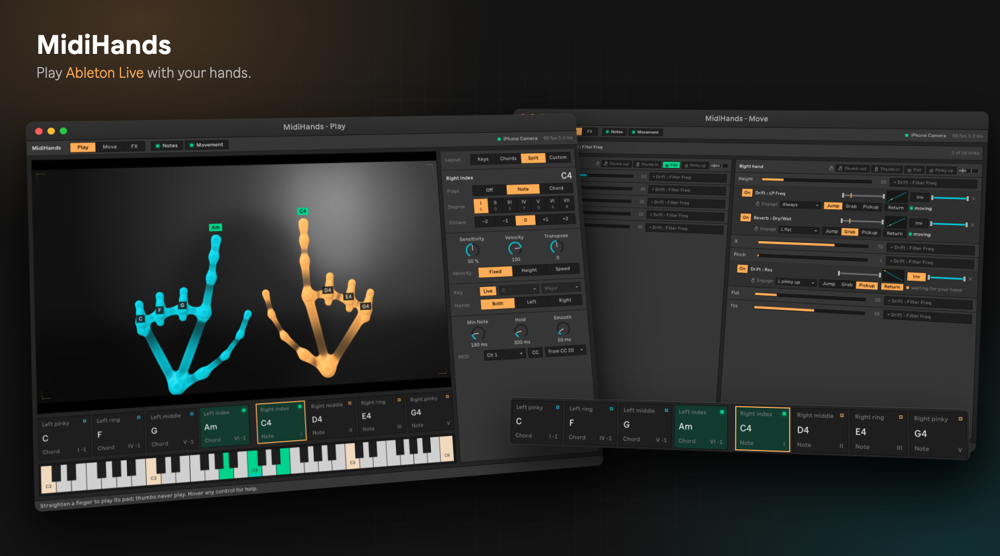
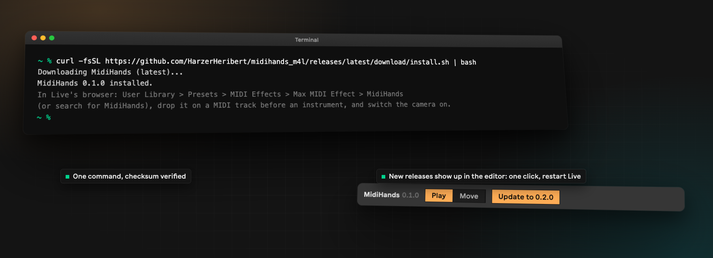
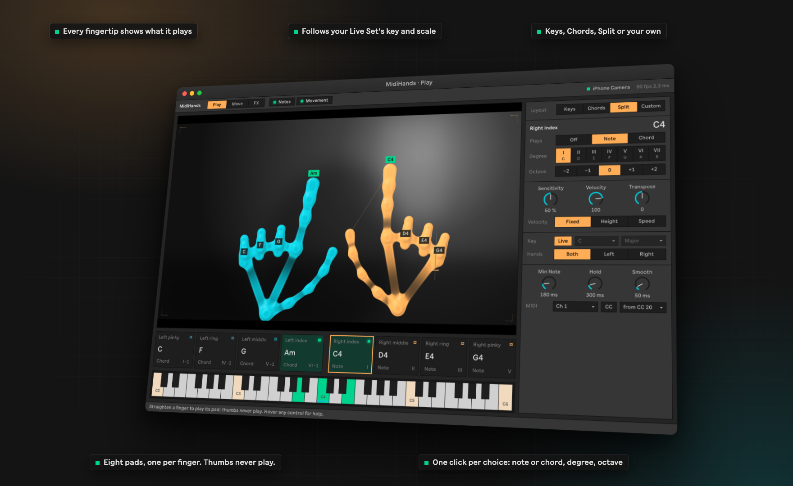
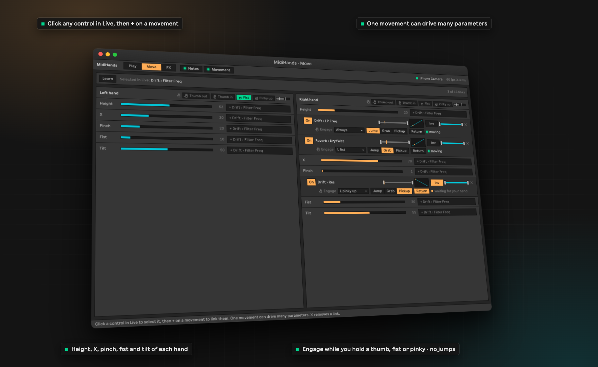
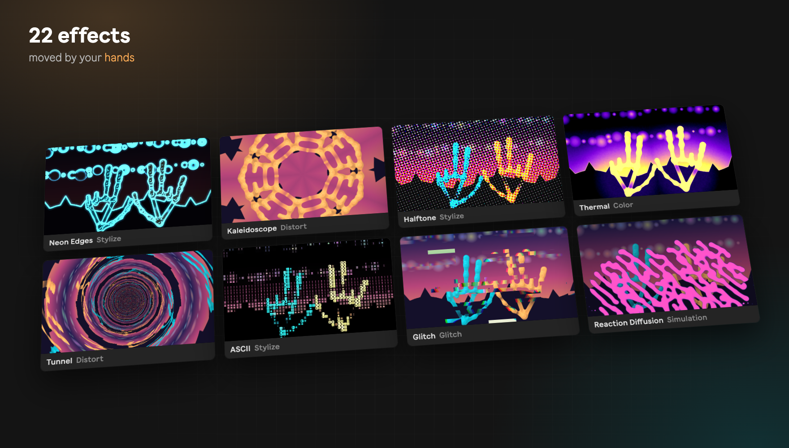
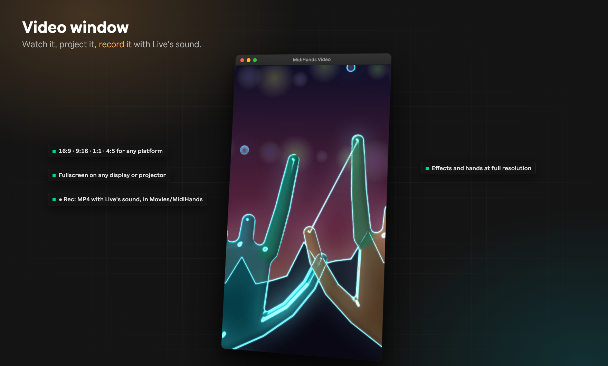

<p align="center">
  
</p>

# MidiHands

**Play Ableton Live with your hands.** MidiHands is a Max for Live device that turns your
camera into an instrument. Straighten a finger to play a note or a chord in your song's key;
raise, pinch or tilt your hand to sweep a filter, open a reverb or ride any knob in Live.
The same movements play 22 video effects, and so can your music, so your set comes with its
own visualizer, ready to record for Instagram, TikTok or YouTube.

[](https://github.com/HarzerHeribert/midihands_m4l/releases/latest)


[Install](#install) · [Quick start](#quick-start) · [Play](#play-notes-and-chords) ·
[Move](#move-parameters-with-your-hands) · [FX](#fx-a-visualizer-you-play) ·
[Effects that follow the music](#effects-that-follow-the-music) ·
[Video and recording](#video-window-and-recording) · [Tips](#tips-for-good-tracking) ·
[Troubleshooting](#troubleshooting)

- **Plays in key.** Eight fingers, eight pads: single notes, chords, or a split with chords
  in one hand and melody in the other. Follows the key and scale of your Live Set.
- **Moves anything.** Link hand height, sideways position, pinch, fist or tilt to any
  parameter in Live. One movement can drive many parameters, each with its own range and curve,
  always or only while you hold a gesture, like a clutch.
- **Plays video, too.** 22 effects, from neon edges to kaleidoscopes and reaction
  diffusion, moved by your hands or by the music. In its own window on a projector, or recorded
  with Live's sound in the format your platform wants.
- **Feels immediate.** Hand tracking runs inside Live, on Apple's Vision framework on a Mac
  and on Google's MediaPipe hand models on Windows: a few milliseconds per frame. No extra
  app, no virtual MIDI ports.
- **Live-native.** Every setting is a Live parameter: saved with your Set, automatable,
  MIDI-mappable. Use it on as many tracks as you like.
- **Private.** Everything runs on your Mac; the camera picture never leaves it.

## Install

You need:

- macOS 14 or newer, on Apple silicon or Intel
- Ableton Live 12 Suite, or Live 12 Standard with the Max for Live add-on
- a camera: built-in, USB, or an iPhone via Continuity Camera

Open Terminal and run:

```bash
curl -fsSL https://github.com/HarzerHeribert/midihands_m4l/releases/latest/download/install.sh | bash
```

<p align="center"></p>

Then restart Live. You find **MidiHands** in Live's browser under **User Library > Presets >
MIDI Effects > Max MIDI Effect**, or just search for it.

Prefer a download? Get `MidiHands-macOS.zip` from
[Releases](https://github.com/HarzerHeribert/midihands_m4l/releases/latest), unzip it, open
Terminal in that folder and run `./install.sh`. Read
[why the script is needed](#why-an-install-script-and-not-a-double-click).

### Windows (beta)

MidiHands for Windows is new and still being tested on more computers. You need Windows 10
or 11 (64-bit), Ableton Live 12 with Max for Live, and a camera. Quit Live, open PowerShell
and run:

```powershell
irm https://github.com/HarzerHeribert/midihands_m4l/releases/latest/download/install.ps1 | iex
```

Everything works as on the Mac except recording the video window, which comes later. The
device and your Sets are the same on both systems. Found a problem? Please
[open an issue](https://github.com/HarzerHeribert/midihands_m4l/issues) and say it is
Windows.

## Quick start

1. Drop **MidiHands** on a MIDI track, before an instrument (Drift, Wavetable, a piano…).
2. Click **Camera** on the device and pick your camera. The first time, macOS asks whether
   Live may use the camera: allow it.
3. Hold up your hands, palms towards the camera, fingers curled. **Straighten a finger** to
   play its note; curl it to stop. Thumbs never play.
4. Click **Open Editor** to choose what each finger plays and to link movements to Live
   parameters. The editor floats above Live like a plugin window.

The device has two switches you can automate or map to a footswitch: **Notes** (fingers play)
and **Movement** (hand movements move parameters). Turn Movement off and every linked
parameter is yours again, with its automation playing back.

## Play: notes and chords

<p align="center"></p>

- **Layouts.** *Keys* gives each finger a note of the scale; *Chords* gives each finger a
  triad; *Split* puts chords (I, IV, V, vi) on the left hand and a melody on the right.
- **Your own layout.** Click a pad, then choose Off, Note or Chord, the scale degree (each
  button shows the note or chord you will get) and the octave. Or click a key on the
  keyboard: notes outside the scale snap to the nearest scale note.
- **Key.** Follows your Live Set's key and scale, or set your own.
- **Feel.** *Sensitivity* sets how far a finger has to straighten; velocity can be fixed,
  follow your hand's height, or the speed of the finger.
- **Hands.** Let both hands play, or only the left or the right (handy with two tracks,
  see [below](#more-than-one-track)).
- **Timing & MIDI.** Shortest note, how long notes survive a brief tracking dropout, MIDI
  channel, and sending the hand movements as MIDI CC for hardware or plugins.

## Move: parameters with your hands

<p align="center"></p>

1. Click any control in Live, for example a filter's cutoff. The top bar shows what you
   selected.
2. Click **+** next to a movement: height, sideways position, pinch, fist or tilt, for
   either hand. The button names the parameter it will link.
3. Done. Move your hand.

Or click **Learn** and make the movement for three seconds: MidiHands picks the movement you
made, links it to the selected parameter and fits the range to how far you moved.

Each link has its own **On** switch, an input range (which part of the movement counts), a
curve, **Inv** to reverse the direction, an output range, and **✕** to remove it. One
movement can drive several parameters at once, up to 16 links per device. Links are saved
with your Set.

### Engage with a gesture

Under each link, **Engage** (the hand symbol) chooses when the hand moves the parameter:
*Always*, or only while you hold a gesture, like a clutch. Hold it, move, let go: the
parameter stays where you left it, and its automation (if any) plays again.

- **Thumb out**: stick the thumb out to the side, away from the hand.
- **Thumb in**: tuck the thumb in against the hand or across the palm.
- **Fist**: close the hand.
- **Pinky up**: straighten the pinky (whatever the other fingers do, so an open hand counts
  too: use it from a curled hand).

Each gesture works on either hand, and thumbs never play notes, so a thumb is a good clutch
on a track that also plays. The gesture buttons next to *Left hand* and *Right hand* light up
while you make them, and the small meter after them shows how far your thumb is from the
hand: past the right mark counts as thumb out, below the left mark as thumb in. A gesture
changes some movements of its own hand (a fist changes the pinch and the fist), so the link
warns you: use the other hand for those.

**Takeover** decides what happens when a link engages and your hand is somewhere else than
the parameter:

- *Jump*: the parameter goes straight to your hand's value.
- *Grab*: the parameter stays and moves by however far your hand moves, like grabbing a knob.
  Let go, move your hand back, grab again and keep going. Picking a gesture selects Grab.
- *Pickup*: the parameter waits until your hand passes its value, then follows.

**Return** puts the parameter back where it was when the link engaged, as soon as you let go:
grab, sweep the filter, let go, and it is back.

## FX: a visualizer you play

<p align="center"></p>

The **FX** page turns the camera picture and your hands into a music video.

1. Pick an effect, and add more with **+ Add effect** (up to eight). They run top to
   bottom, so a *Glow* after *Neon Edges* makes the edges shine. Drag an effect by its grip
   to move it; **⋯** (or ⌘C, ⌘V, ⌘D and Delete on the selected effect) copies, pastes,
   duplicates and deletes. Copied effects paste into other MidiHands devices too. The
   effects come in six groups: Color, Stylize, Distort, Feedback (echoes, trails, time
   warp), Glitch and Simulation.
2. Under any knob, and under **Mix**, choose a hand movement (or a sound, see below), then
   drag the small bar next to it: to the right the movement turns the knob up, to the left
   down. An orange dot on the knob shows where it has moved it. Pinch to zoom a
   kaleidoscope, make a fist to flash a strobe, raise your hand to bend a tunnel.
3. Choose how hands are drawn: **Jelly** (the glossy look of the original midihands app),
   **Lines** or **Off**, in Live's cyan and orange or in **Amber**. **Cues** draw what each
   movement is doing right on your hands: the pinch distance, the height, the fist.

Each effect has an **On** switch (automatable: switch effects on and off in your
arrangement), and a gesture can switch it (the hand symbol, see
[Engage with a gesture](#engage-with-a-gesture)): **Hold** shows the effect while you hold
the gesture, **Toggle** turns it on with one gesture and off with the next. Each effect keeps
its own Live parameters (FX1 to FX8) wherever you move it, so its automation moves with it.

Effects marked *Follow Hands* move their center to your hands. **Camera** sets how much of
the camera picture shows: at 0 only the hands and effects remain, on black. Every FX
control is a Live parameter too, so you can automate it or map it to a controller.

## Effects that follow the music

Put **MidiHands Audio** on any track: the kick, the drum group, or Main for the whole mix.
You find it in Live's browser under User Library > Presets > Audio Effects > Max Audio
Effect. It passes the sound through unchanged and sends five values to MidiHands:
**Level**, **Bass**, **Mid**, **High** and **Beat**, a pulse on every hit.

Each MidiHands Audio sends as a letter, A to H. Pick it under any FX knob, for example
*A Beat*, next to the hand movements. Use as many as you like: the kick on A pumps a glow,
the hats on B ripple the picture, the whole mix on C sets the brightness. The FX page shows
the letters it hears, with live meters and the track names.

On the device: **Gain** and **Auto Level** set the range (Auto Level keeps quiet and loud
material moving the full way), **Smooth** how slowly values fall back, **Beat Sens** how
easily a hit counts, and **Decay** how long a beat pulse lasts.

## Video window and recording

<p align="center"></p>

Click **Video window** on the FX page for the picture in its own window, at full
resolution. Resize it freely; the picture keeps its format: **16:9** for YouTube and
screens, **9:16** for Reels, Stories and TikTok, **1:1** or **4:5** for feed posts.
For a projector or a second screen, drag the window there and make it as large as the
display.

Click **● Rec**, in the window or on the FX page, to record the picture with Live's sound.
The video is saved as an MP4 (H.264 and AAC) in *Movies/MidiHands*, ready to upload. In
the video window, R starts and stops a recording and F shows the last one in Finder.

The first time you record, macOS asks whether Ableton Live may record the screen and system
audio. Allow it in System Settings > Privacy & Security > Screen & System Audio Recording,
then restart Live.

## Tips for good tracking

- **Light matters most.** Many webcams halve their frame rate in dim rooms (30 → 15 fps),
  which makes everything feel slower. The editor shows the camera's frame rate at the top.
- **More frames, less delay.** An iPhone used as a Continuity Camera delivers 60 fps.
- **Show your whole hand.** Palms towards the camera, hands fully in the picture; a calm
  background helps. Hands covering each other are the hardest case.
- **Too twitchy or too lazy?** Turn *Sensitivity* down or up; raise *Min Note* if notes
  flicker.
- **Newer macOS, better tracking:** macOS 26 includes Apple's newer hand-pose model.

## More than one track

Put MidiHands on as many tracks as you like: all of them share one camera and one hand
tracker, so they always agree and add almost no extra load. Each keeps its own settings, for
example a piano track played by the left hand in *Chords* and a synth played by the right
hand in *Keys*, while a third track only uses movements. Several cameras work too: each one
runs only while some device uses it.

## Updates

When the editor opens it checks for a new release. If there is one, an **Update** button
appears in its top bar: click it, then restart Live. You can also run the install command
again at any time. See [CHANGELOG.md](CHANGELOG.md) for what changed.

## Troubleshooting

**MidiHands is not in Live's browser.** Restart Live after installing and search for
"MidiHands". If you moved your User Library, run the install command again: it looks up the
location Live uses.

**"Camera access denied".** Open System Settings > Privacy & Security > Camera and allow
Ableton Live, then switch the camera off and on in the device. On Windows: Settings >
Privacy & security > Camera > "Let desktop apps access your camera".

**Windows: no camera at all, or MidiHands does not load.** Windows "N" editions lack Media
Foundation: install the Media Feature Pack from Microsoft.

**macOS says `mh.hands` cannot be opened, or the device shows no camera list.** The files
were probably copied from a browser download by hand. Run the install script, which installs
them without the download flag.

**No notes play.** Check that the **Notes** switch is on, that an instrument follows
MidiHands on the same track, and that the editor's fingertip labels light up when you
straighten a finger. Hands should face the camera.

**Recording failed.** Allow Ableton Live in System Settings > Privacy & Security > Screen &
System Audio Recording and restart Live. The video window must be open and on screen
while it records; it may be behind other windows, but not minimized.

**A letter on the FX page shows in red.** Two MidiHands Audio devices send as the same
letter; give each its own.

**Files disappear after a while.** If your Documents folder is in iCloud Drive with "Optimize
Mac Storage", macOS may remove local copies of `Documents/Max 9/Packages`. Keep that folder
downloaded, or run the install command again.

### Why an install script and not a double-click

MidiHands contains a small native program that reads the camera. It is not notarized by
Apple, and macOS blocks un-notarized programs that arrive through a browser download. The
script downloads with `curl`, checks the file's SHA-256 checksum, and copies the Max package
to `~/Documents/Max 9/Packages/midihands` and the device to your User Library. That is all it
changes. Read it first if you like: [scripts/install.sh](scripts/install.sh).

## Privacy

Hand tracking runs entirely on your Mac. The camera picture is only shown in the device's
own windows, over the computer's internal network interface (127.0.0.1). Recordings are
saved only to *Movies/MidiHands* on your Mac. The only internet access is the update check
and download from GitHub.

## Uninstall

Run `./uninstall.sh` from the release folder (on Windows: right-click `uninstall.ps1` > Run
with PowerShell), or delete `~/Documents/Max 9/Packages/midihands`,
`MidiHands.amxd` in your User Library under Presets > MIDI Effects > Max MIDI Effect, and
`MidiHands Audio.amxd` under Presets > Audio Effects > Max Audio Effect.

## Contributing and building

Bug reports and ideas are welcome as [issues](https://github.com/HarzerHeribert/midihands_m4l/issues);
see [CONTRIBUTING.md](CONTRIBUTING.md). To build from source, run the tests or make a
release, see [docs/DEVELOPMENT.md](docs/DEVELOPMENT.md).

## License

Copyright Eneas Dembach. All rights reserved; official release builds are free to use for
making music. See [LICENSE](LICENSE).
